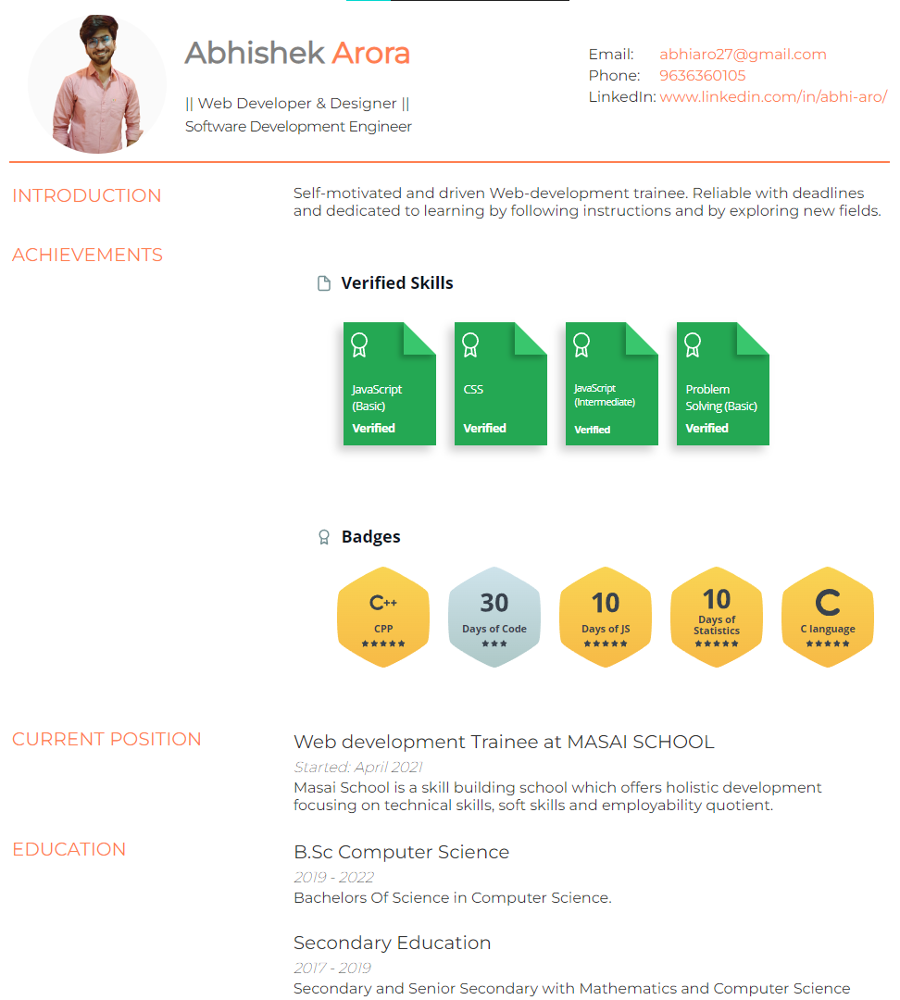

<h1 align="center">Welcome to My First Resume 👋</h1>


This is a static webpage for my earliest resume.



<br/>

# Dependencies and Tech stack used 💻

1. [HTML](https://html.com/)
1. [CSS](https://www.w3schools.com/css/)

<br/>

# How to run the project 📑


## Install using

```
no installations required all the requirements are included in the repository
```

## Usage

```sh
just clone it and open index file
```

---

<br/>

## Authors

👤 **Abhishek**

- Website: [Portfolio](https://abhi-aro.tech/)
- Github: [@abhi-aro](https://github.com/abhi-aro)
- LinkedIn: [@abhi-aro](https://linkedin.com/in/abhi-aro)

## Show your support

Give a ⭐️ if you liked this project!

Feel free to add any changes.

---
